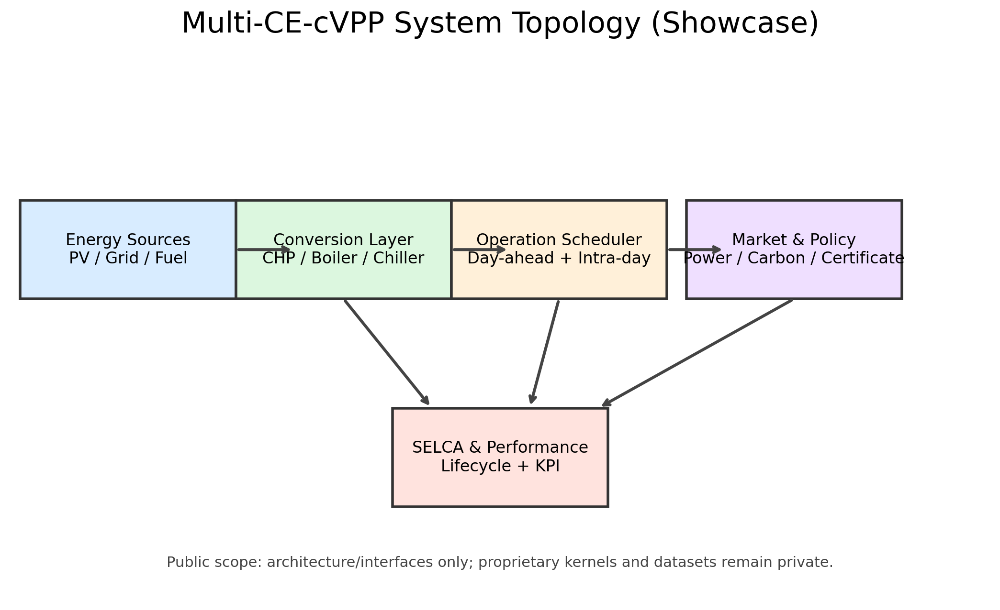
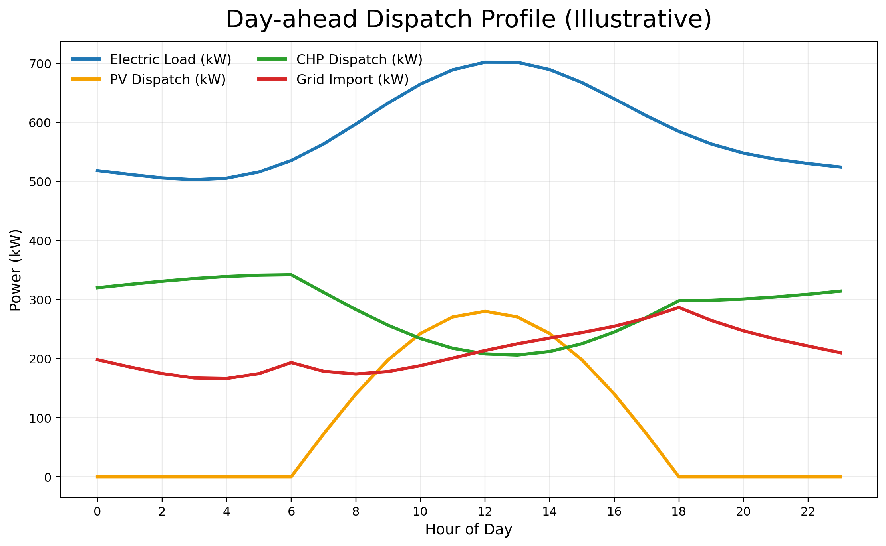
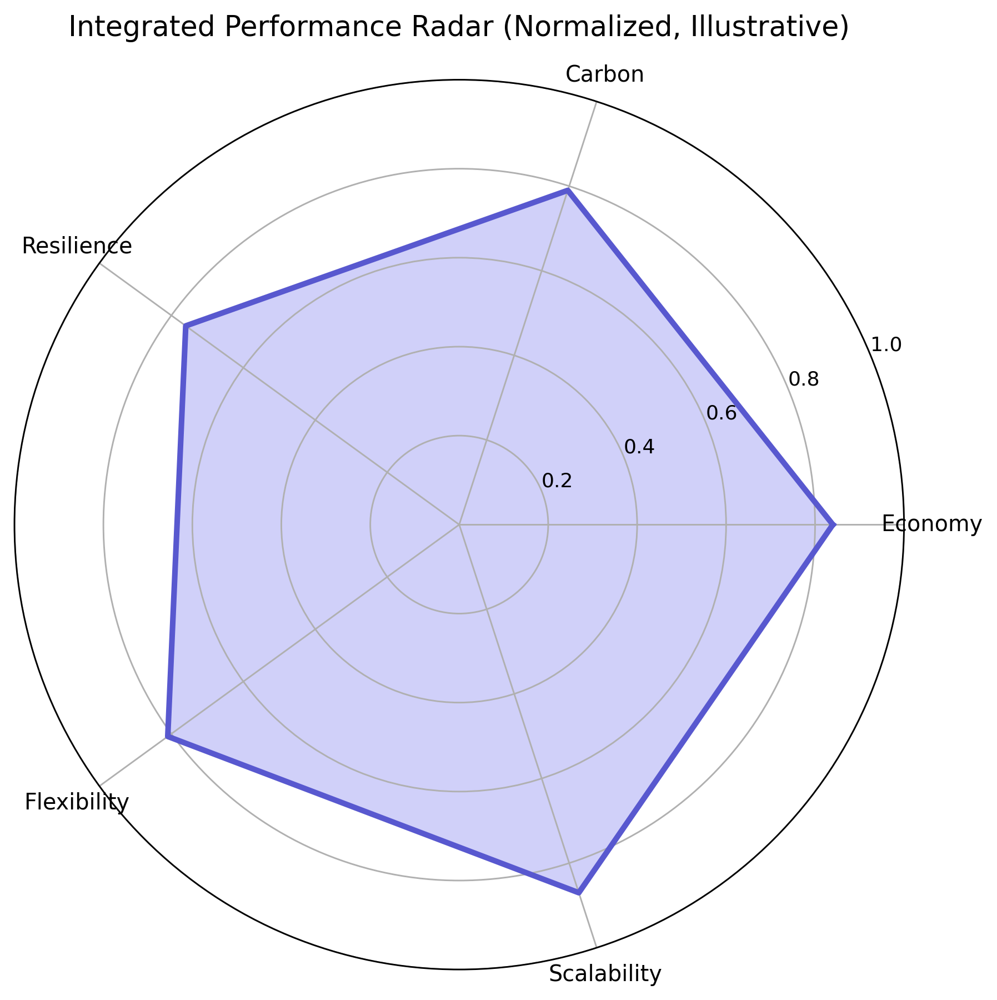

# Multi-CE-cVPP

面向社区级多能流系统的公开展示仓库（Showcase Edition）。

> This repository is a **public technical showcase**.  
> It presents architecture, assumptions, and interface contracts only.  
> Production-grade algorithms and operational datasets are maintained in a separate private core repository.

## 愿景与定位

Multi-CE-cVPP 旨在构建一个可扩展、可审计、可解释的多能互补社区虚拟电厂框架，覆盖：

- 能源系统物理建模（电-热-冷-气耦合）
- 生命周期可持续性评估（SELCA）
- 多元绿色市场映射（电价、碳价、绿证、税费）
- 运行调度与事后绩效评价（规划中的公开接口）

本公开仓库用于展示方法学框架、接口设计与工程规范，便于国际同行、审稿人与投资方快速理解系统能力边界。

## 架构拓扑（展示版）

```text
┌──────────────────────────────────────────────────────────┐
│                  Multi-CE-cVPP Showcase                 │
├──────────────────────────────────────────────────────────┤
│  Layer 1: components   -> 物理设备层（能量转换）          │
│  Layer 2: operation    -> 运行调度层（时序决策）          │
│  Layer 3: selca        -> 生命周期量化层（环境与资源）    │
│  Layer 4: market       -> 市场交互层（电/碳/绿证/税费）   │
│  Layer 5: performance  -> 综合评价层（多指标评估）        │
├──────────────────────────────────────────────────────────┤
│  Public: docs + interfaces + figures                    │
│  Private: executable kernels + proprietary datasets      │
└──────────────────────────────────────────────────────────┘
```

## 仓库内容

- `docs/ASSUMPTIONS.md`：系统假设与物理边界
- `docs/MATHEMATICAL_BOUNDARY.md`：关键守恒方程与约束表达
- `src/interfaces/`：高维接口与占位函数（仅文档化，不含业务实现）
- `assets/figures/`：对外展示图表（请替换为你的实际成果图）
- **`showcase/selca/`**：**SE-LCA 生命周期量化可视化**（静态页 + 预计算 JSON；适合企业展示）。说明见 [`showcase/selca/README.md`](showcase/selca/README.md)。本地：`cd showcase/selca && ./serve.sh`。**公网**：在仓库 **Settings → Pages** 将 **Source** 设为 **GitHub Actions**，推送 `main` 后由 [`.github/workflows/deploy-selca-pages.yml`](.github/workflows/deploy-selca-pages.yml) 发布。**正式入口（可挂在个人站 Projects）：** **`https://xie-haonan.github.io/Multi-CE-cVPP/selca/`**；访问仓库根路径 `https://xie-haonan.github.io/Multi-CE-cVPP/` 会自动跳转到 `selca/`。（与 [个人主页](https://xie-haonan.github.io/) 同属 `github.io` 域名，本链接为项目站子路径。）

## 展示图（Illustrative）

### 系统拓扑图


### 调度结果剖面图


### 综合评价雷达图


## 痛点与价值

- 面向审稿场景：提供完整方法学叙述，避免“黑盒系统”质疑
- 面向产业沟通：明确边界条件、输入输出、可验证性与可扩展性
- 面向生态协作：用接口契约对齐多方开发，降低集成风险

## 合规说明

- 本仓库不包含可直接复现实盘策略的核心实现。
- 本仓库不包含私有业务数据、敏感配置与商业机理参数。
- 如需深度合作，请通过 NDA 流程访问私有核心仓库。

## 公开边界与红线（建议审阅者先读）

- 你在本仓库看到的是 **方法学框架 + 接口契约 + 展示图表**，用于技术沟通与学术评审。
- 你在本仓库看不到 **生产可执行内核、私有参数库、业务数据资产、策略求解器实现**。
- `src/interfaces/` 中函数采用 `NotImplementedError` 作为边界声明，避免被误用为可运行系统。
- 若需可运行版本验证，请走 NDA 流程并在受控环境中审阅私有仓库。
